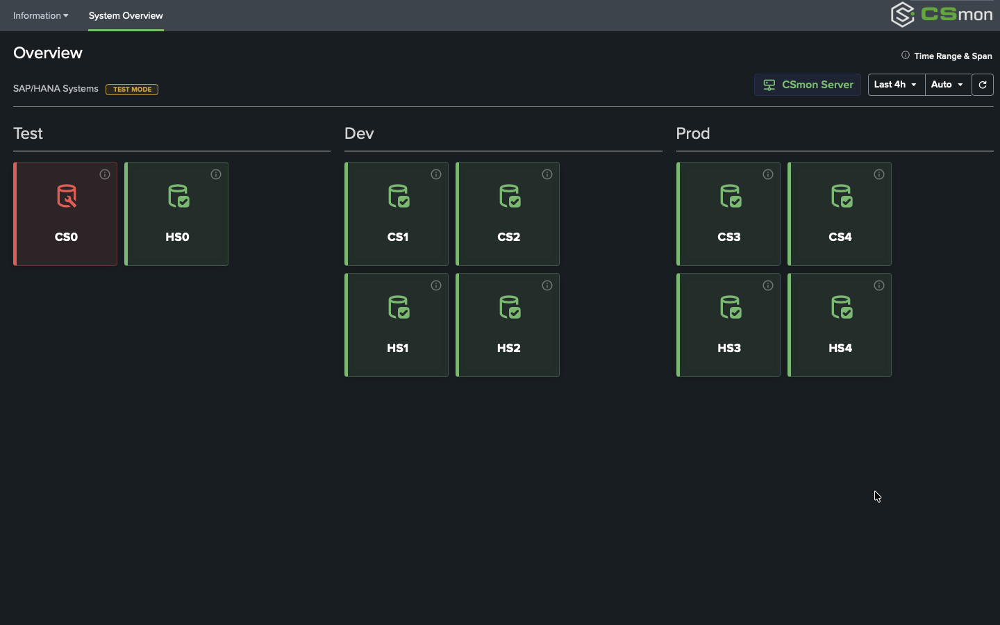
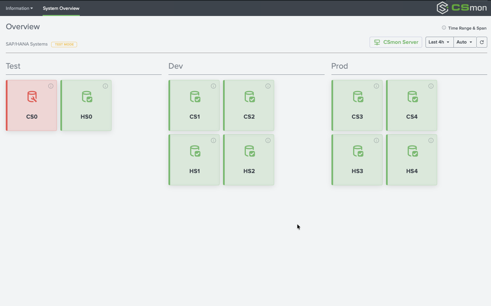

# CSmon® Add-on for Splunk

**CSmon® Add-on** is a premium Splunk Technical Add-on (TA) designed for sophisticated SAP and HANA monitoring. It provides a high-performance bridge between the **CSmon® Monitoring Server** and **Splunk**, featuring state-of-the-art "Studio" aesthetics.

*Modern, high-contrast Dark Mode for mission-critical monitoring.*

## Key Highlights

- **Studio Aesthetic**: Clean, professional design (24px, Weight 400) perfectly synchronized with Splunk Studio guidelines.
- **Dual Mode Support**: Seamless support for both **Dark** and **Light** modes with curated color palettes.
- **Premium Monitoring**: Real-time insights into SAP HANA databases and Application Servers.
- **Responsive Layout**: Fluid UI that adapts perfectly from large mission control screens to mobile devices.
- **Optimized Performance**: Lightweight architecture ensuring fast load times and minimal browser overhead.

*Professional Light Mode with subtle brand accents.*

---

## Quick Start

### 1. Installation

Download and install the `vhc_TA_csmon-x.x.x.tar.gz` via the Splunk "Install app from file" menu or Splunkbase.

### 2. Basic Configuration

1. Navigate to the **CSmon Add-on** configuration page.
2. Configure your **CSmon® Monitoring Server** credentials.
3. Define your **System Scope** (prefilled by default).
4. Set the target **Index** where your monitoring data is stored.

### 3. Data Inputs

Ensure your environment is sending data using the following sourcetypes:

- `csmon:hostperf`
- `csmon:serviceperf`

---

## Demo Mode

Experience the full potential without a backend. Enable **Demo Mode** in the settings to explore all dashboards with pre-populated mock data.

## Documentation

For detailed configuration guides and troubleshooting, please refer to the integrated help section within the Add-on.

---
© 2026 CSmon® Monitoring Solutions
